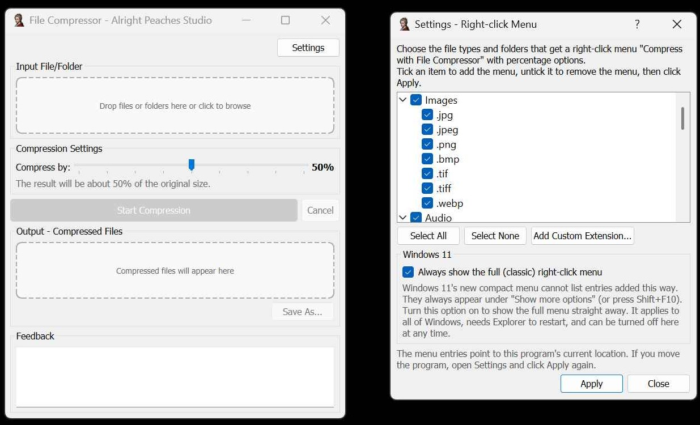

# FileCompressor - Made by Alright Peaches Studio

# [Other Apps and Games Made by Alright Peaches Studio](https://store.steampowered.com/search/?developer=Alright%20Peaches%20Studio)



A powerful and user-friendly file compression tool built with PyQt5. Supports multiple file formats including videos, audio files, images with intelligent compression algorithms.

  

## ✨ Features

### 🎯 Core Features
- **Multi-format Support**: Videos (MP4, AVI, MOV, MKV, WMV, FLV, WebM), Audio (MP3, WAV, FLAC, AAC, OGG, M4A), Images (JPG, PNG, BMP, TIFF)
- **Drag & Drop Interface**: Simply drag files or folders into the application
- **Batch Processing**: Process entire folders while maintaining directory structure
- **Smart Compression**: Automatically prevents files from becoming larger after compression
- **5-level Compression Control**: From highest quality to maximum compression
- **Real-time Feedback**: Live progress updates and detailed processing information
- **Use the right-click menu to compress**: You can use the right-click menu to compress files without opening the software.
- **You can also freely add or remove items from the right-click menu for specific file types in the software's settings.

## 🚀 Quick Start

### Prerequisites
- **Python 3.7+**
- **Windows OS** (Currently Windows-only)
- **FFmpeg** (included in release or download separately)

## 📖 Usage Guide

### Basic Operation
1. **Select Input**: Drag files or folders into the input area, or click to browse
2. **Adjust Settings**: Use the compression level slider (1=Highest Quality, 5=Maximum Compression)
3. **Start Compression**: Click "Start Compression" button
4. **Save Results**: Once completed, drag from output area or click to choose save location

### Compression Levels
- **Level 1 (Highest Quality)**: Minimal compression, best quality
- **Level 2 (High Quality)**: Light compression, excellent quality
- **Level 3 (Medium)**: Balanced compression and quality *(Default)*
- **Level 4 (Low Quality)**: Higher compression, reduced quality
- **Level 5 (Lowest Quality)**: Maximum compression, lowest quality

### Supported Formats

| Category | Supported Formats | Output Format |
|----------|------------------|---------------|
| **Video** | MP4, AVI, MOV, MKV, WMV, FLV, WebM | MP4 (H.264) |
| **Audio** | MP3, WAV, FLAC, AAC, OGG, M4A | MP3 |
| **Images** | JPG, PNG, BMP, TIFF | JPG |


## 🛠️ Technical Details

### Architecture
- **Frontend**: PyQt5 with custom drag-and-drop widgets
- **Backend**: Multi-threaded processing using QThread
- **Compression Engine**: FFmpeg for multimedia files
- **File Handling**: Python standard library with pathlib

### Compression Strategies
- **Videos**: H.264 encoding with variable CRF values
- **Audio**: AAC/MP3 encoding with adjustable bitrates
- **Images**: JPEG compression with quality control and slight scaling


### Safety Features
- **Size Validation**: Prevents output files from being larger than input
- **Temporary Processing**: Uses system temp directory to avoid data loss
- **Error Recovery**: Graceful handling of processing failures
- **Memory Management**: Efficient resource usage with proper cleanup

## 📁 Project Structure

```
file-compressor/
├── FileCompressor.py      # Main application file
├── ffmpeg.exe             # FFmpeg executable (user-provided)
├── 2.ico                  # Application icon (optional)
├── LICENSE                # MIT License
├── README.md              # This file

```

## 🐛 Bug Reports

Found a bug? Please create an issue with:
- **System Information**: OS version, Python version
- **Steps to Reproduce**: Detailed reproduction steps
- **Expected vs Actual Behavior**
- **Screenshots** (if applicable)
- **Log Output**: Any error messages from the feedback area

## 📋 Requirements

### System Requirements
- **OS**: Windows 7/8/10/11
- **RAM**: 2GB minimum, 4GB recommended
- **Storage**: 100MB for application + space for temporary files
- **CPU**: Any modern processor

### Python Dependencies
```txt
PyQt5>=5.15.0
```

## 📄 License

This project is licensed under the MIT License - see the LICENSE file for details.

## 🙏 Acknowledgments

- **FFmpeg Team** - For the powerful multimedia processing library
- **Qt/PyQt5 Team** - For the excellent GUI framework
- **Open Source Community** - For inspiration and best practices
